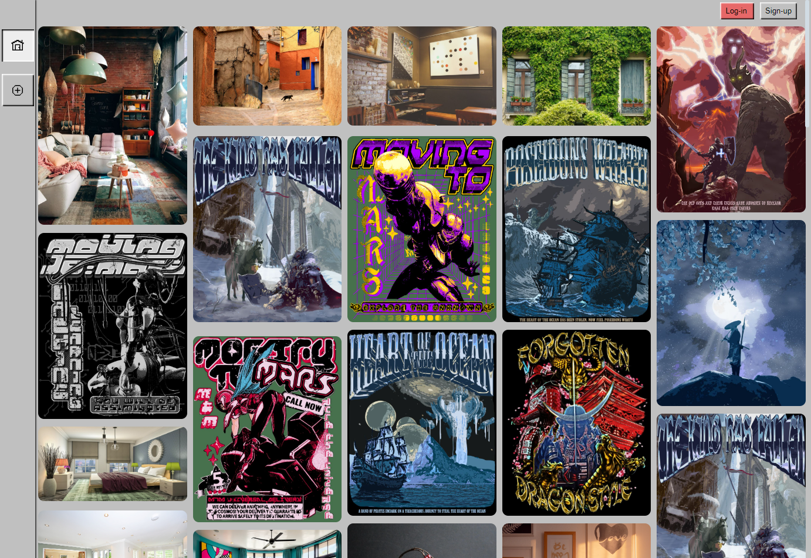
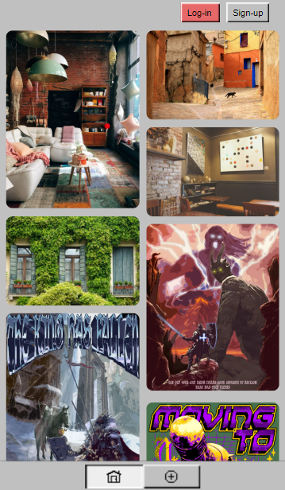
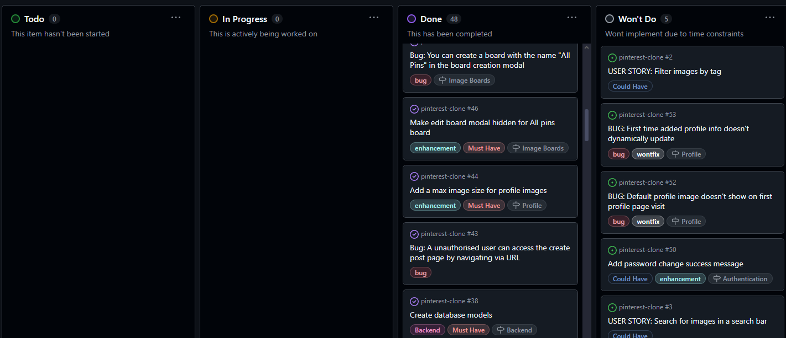
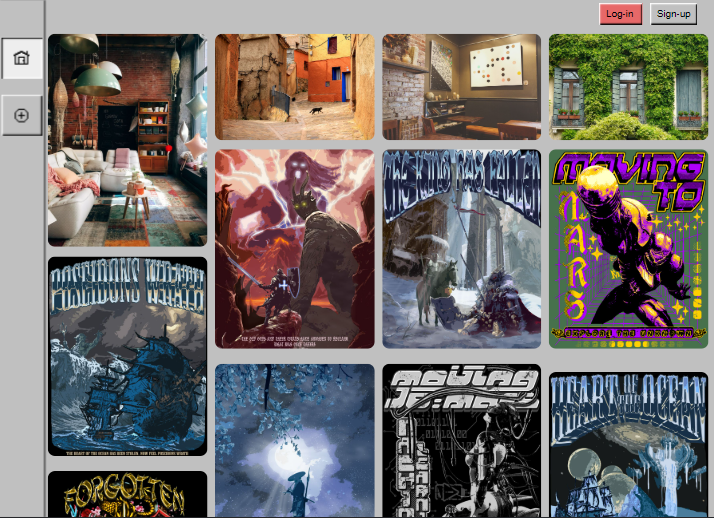
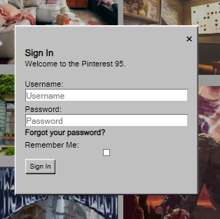
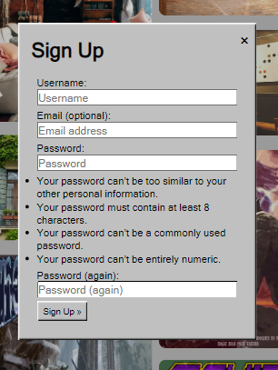
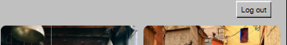
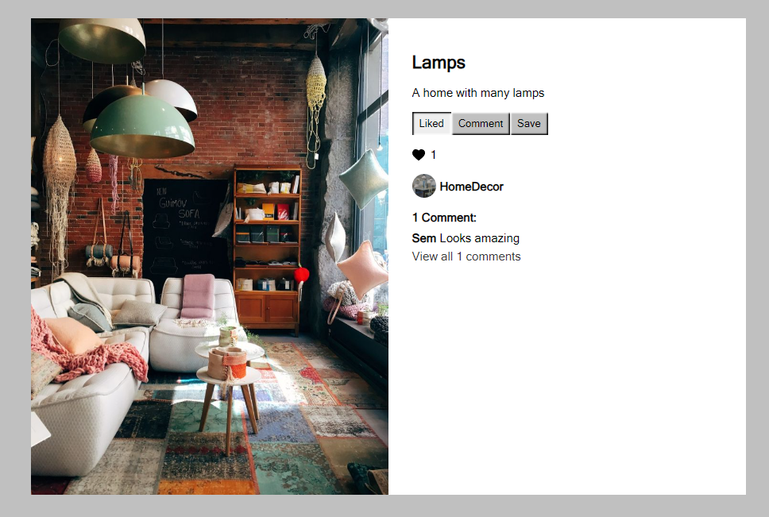

# Pinterest95
The Pinterest95 project is a retro-styled image-sharing and discovery platform inspired by the windows 95 aesthetic, it is a social media platform that allows users to discover new inspiration for anything and everthing. Users can create image/mood boards of posts they like, interact with images, and share posts of their own. 





To use the features of Pinterest95 a user must create and account on log in. Afterwards a user will then be able to:

- Create/Delete posts
- Comment/Like posts
- Create/Edit/Delete image boards
- Save images to image boards

and many other interactive features.

This is a Django-basedd website with all CRUD functionality, agile methodologies were used to plan and implement all features.

The deployed site can be found [HERE](https://pinterest-clone-sem-29d41bc2ed17.herokuapp.com)

# Table of Contents
- [The Strategy Plane](#the-strategy-plane)
    - [Site Goals](#site-goals)
    - [Agile Planning](#agile-planning)
- [The Scope Plane](#the-scope-plane)
    - [Epics](#epics)
    - [User Stories](#user-stories)
- [The Structure Plane](#the-structure-plane)
    - [Features](#features)
        - Homepage
        - Post Detail Page
        - Profile Page
        - Board Detail Page
        - Create Post Page
    - [Unimplemented Features](#unimplemented-features)
    - [Future Features](#future-features)
- [The Skeleton Frame](#the-skeleton-plane)
    - [Wireframes](#wireframes)
    - [Database Design](#database-design)
    - [Security](#security)
- [The Surface Plane](#the-surface-plane)
    - [Design](#design)
    - [Colour Scheme](#color-scheme)
    - [Typography](#typography)
- [Technologies](#technologies)
    - [Technology Used](#technology-used)
    - [Python Modules Used](#python-standard-modules)
    - [External Python Modules Used](#external-python-modules)
- [Bugs](#bugs)
    - [Fixed Bugs](#fixed-bugs)
    - [Unfixed Bugs](#unfixed-bugs)
- [Deployment](#deployment)
    - [Version Control](#version-control)
    - [Heroku Deployment](#heroku-deployment)
    - [Run Locally](#run-locally)
    - [Fork Project](#fork-project)
- [Credits](#credits)

# The Strategy Plane

## Site Goals

The primary site goals are to offer users a sharing and disovery experience allowing them to explore content and get visual inspiration seamlessly.

### Functional Goals 

- Image sharing and discovery
    - Users can upload, store, and share images with a community
- User profiles and personalisation
    - Users have their own profile pages which can be customised
- Engagement and interaction
    - Users can interact with other posts, fostering engagement 
- Authentication & account management
    - User can log-in/sign-up
- Search & discoverablilty (not implemented yet)
    - Users can search for posts and explore content based on interest
- Mobile & desktop compatibility
    - The site is designed to be responsive across devices

### User-Centric Goals
- Casual Users
    - Users looking for visual inspiration can browse content effortlessly
    - Intuitive design with aesthetic, nostalgia-driven UI
- Content Creators
    - Provides an easy way to showcase creative work
    - Profile customization and engagement features (likes, comments)
- Community Building
    - Encourages social interaction through likes and comments

### Business & Technmical Goals
- Performance & Scalability
    - Use cloud-based image hosting for faster image serving
    - Database optimisation such as UUIDs for posts (better indexing and scalability)
- Security & Privacy
    - CSRF protection and authentication handled by Django Allauth.
- Potential Monetisation and Growth
    - Possible future ad-based revenue model
    - Could expand with premium profiles or exclusive content features

# The Scope Plane
## Agile Planning

This project was developed using agile methodologies by delivering small features in incremental sprints. As this was my first full-stack project I did not know how long each feature would take to implement due to lack of experience, as a result the sprints were not given a time frame individually. The total time for all features to be impementated was 2 months. The long time frame was to allow for a lack of efficiency while I gained more experince with Django and the whole process of developing a full-stack application.

All user stories were assigned to epics, prioritised under the labels, Must have, Should have and Could have. "Must have" stories were the most important fetures and were subsequently implemented first, then the "Should haves" were implemented and finally the "Could haves". Some "Could haves" were not implemented due to time constraints. Feature implementation was done this way to ensure all core requirments were implemented first, with nice to have features being added with available capacity.

The Product Backlog was created using Github projects and can be located [HERE](https://github.com/users/SemMTM/projects/2/views/1). All user stories have acceptance criteria in order to define the functionality that marks that story as complete.



## Epics

This project had 7 main epics that user stories were catagorised into:

#### Authentication
The Authentication epic is for all user stories pertaining to user authentication and registration. This epic provides crutial functionaliy and security to the app and users. Without user authentication almost of all the features Pinterest95 currently has would not be do-able.

#### Backend
The Backend epic is for all stories related to the set up of the project and database. Another critical epic as without the server-side set up or database the app would not function.

#### Comments
The Comments epic is for all user stories related to the comment functionailty. This includes, creating, editing, deleteing comments and other minor comment related features.

#### Home Page
The Home Page epic is for all user stories related to the home page. This is particularly important as this is the area where users will discover new content and spend most of their time. This epic includes all user stories related to the masonry grid layout and implementation as well as the nav bar.

#### Image Boards
The Image Boards epic is for all user stories relating to the mood boards of images that users can create. A big part of the goals of the app is to help users get visual inspiration, allowing users to save and collect images into one area that they can specify and customise is cruital to the user experience.

#### Posts
The Post epic is for user stories related to post creation, deletion, like, image tags etc.

#### Profile
The Profile epic is for all user stories related to the users own profile page. The profile page is where users can customise their experince and is the area that other users can also see. This page shows the users public image boards, all posts they have created, their public profile info and more.

## User Stories

#### Authentication
- As a user I can Sign in/Log in via a pop up modal so that I don't need to go to a new page to sign in
- As a user I can log out
- As a user I can sign in to the app so that I can use all of its features
- As a user I can tell if I am logged in so that I can log in if needed
- As a user I can create an account so that I can use all of the sites features

#### Backend
- As a developer I need to create my database models so that I can store and access information for the app to function
- As a developer I need to set up all auth so that my app can have user authentication
- As a developer I need to connect my app to my SQL database so that I can store information to create the app
- As a developer I need to set up cloudinary so that users can upload images

#### Comments
- As a user I can see how long ago a comment was made so that I know how old a comment is
- As a user I can see left a specific comment on an image so that I know who left the comment
- As a user I can delete one of my comments from a post
- As a user I can edit or delete comments I have made so that I can interact with other users
- As a user I can delete comments on my post so that I can manage my content better
- As a user I can comment on a post so that I can interact with other users

#### Home Page
- As a user I can search for image themes so that I can find related images (not implemented)
- As a user I can find images by clicking tags so that I can find content related to the tag (not implemented)
- As a User I can access a nav bar so that I can go to different pages on the website
- As a user I can see posts in a masonry grid so that my user experience is better
- As a user I can see a list of images so that select which image I would like to open

#### Image Boards
- As a developer I can create a blank "All Pins" board for every user so that they can see all their pinned images
- As a user I can edit an image boards visibility and title so that I have more control over my experience
- As a user I can see an image board with all of my pinned images so that I can go through my pins quickly
- As a user I can open image boards so that I can see a list of the images saved to it
- As a user I can edit my image boards so that I can customise them to my preferences
- As a user I can create image boards so that I can save images to it and view them later

#### Posts
- As a developer I can convert image to JPEG and compress them before upload so that image load much faster for users
- As a user I can tag an image with image tags so that other users can see what the post is about
- As a user I can like an image so that I can interact with posts I enjoy
- As a user I can see who uploaded a post so that I can go to their profile and see more about the user
- As a user I can delete my posts so that I can remove posts I don't want to be uploaded anymore
- As a user I can pin images to one of my image boards so that I can see all images in one place
- As a user I can create a post so that I can share content
- As a User I can Open a post so that view it in greater detail

#### Profile
- As a user I can have a unique username so that users can find my profile
- As a developer I can create a blank user profile with a default image when a user is created
- As a User I can edit my profile information so that I can manage my profile
- As a user I can see image boards other users have created so that I can look through their saved images
- As a user I can view my created posts so that I can manage them
- As a user I can view a users profile so that I can interact with other users
- As a user I can see a list of my and other users created image boards on the profile so that I can view image collections

[Back to Table of Contents](#table-of-contents)

# The Structure Plane

## Features

## Homepage

### Masonry Grid
---
#### Description
The Masonry Grid on the dynamically arranges images in a visually appealing, staggered layout. This feature ensures that images of varying heights fit together neatly while maximizing screen space and providing a visually appealing browsing experience. The masonry grid is used in multiple areas within the project: the board detail page, home page and created pins section.



#### Implementation

1. Backend (Django View)
    - The `PostList` class-based view fetches posts ordered by creation date
    - Implements pagination to retrieve 10 posts per request
    - Supports HTMX-based dynamic loading, ensuring that new posts are loaded efficiently
2. Frontend (HTML & CSS)
    - The homepage contains a .image-grid container that holds post items
    - `image_list.html` renders posts inside `.grid-item` elements, ensuring a consistent grid structure
    - CSS Grid & Flexbox are used to define a responsive column layout
3. JavaScript for Masonry Effect
    - `masonry.js` ensures that each image is correctly positioned within the grid
    - Uses `resizeGridWithImages()` to calculate row spans dynamically based on image heights
    - Listens for HTMX events (htmx:afterSwap) to adjust the layout when new posts are loaded

#### Why This Implementation Works Well:
- Automatically adjusts image positions based on height
- Ensures a responsive layout across different screen sizes
- Efficient grid updates when new posts are loaded
- Smooth user experience without layout shifts or gaps

#### User Stories Completed

### Infinite Scroll
---
#### Description
Infinite scrolling allows users to continuously load more posts without having to navigate through traditional pagination. Instead of manually clicking through pages, new posts are fetched and displayed automatically as the user scrolls down.

#### Implementation

1. Backend (Django View)
    - The `PostList` class-based view in views.py handles paginated requests
    - Uses Django’s built-in pagination to fetch 10 posts per request
    - If a request is made via `HTMX`, it dynamically loads more posts
2. Frontend (HTMX & Templates)
    - The homepage includes an initial set of posts and a trigger for infinite scrolling
    - `HTMX` is used to fetch the next page of posts when the user reaches the end of the current list
    - `image_list.html` contains only the post items, ensuring that `HTMX` swaps new posts into the existing grid seamlessly.
3. JavaScript for Masonry Layout
    - `masonry.js` ensures that newly loaded images are properly arranged within the grid
    - Listens for `HTMX` events like `htmx:afterSwap` to resize grid items after new posts load
    - Uses `imagesLoaded()` to wait for images to fully load before adjusting layout

#### Why This Implementation Works Well:
- Seamless scrolling experience without page reloads
- Efficient batch loading with Django’s Paginator
- Optimized UI updates using HTMX and Masonry.js
- Prevents unnecessary requests by stopping when there are no more posts

### Navbar & Profile Page Button (Authenticated Users Only)
---
#### Description
The Navbar provides users with quick access to (currently implemented) key sections of the website. It adjusts dynamically based on whether the user is authenticated. One key feature is the Profile Page Button, which is only visible to logged-in users. If a user is not authenticated, the profile button is hidden to prevent access to profile-related features.


#### Implementation
1. Backend (Django view)
    - The navbar is included in base.html, ensuring it is available across all pages
    - Uses Django template conditionals to show/hide elements dynamically
        - If the user is logged in, the profile button is displayed, linking to their profile page
        - If the user is not logged in, the profile button is hidden
2. Frontend (CSS & HTML)
    - Navbar Structure:
        - A horizontal navigation bar for mobile users
        - A vertical sidebar navigation for desktop users
    - CSS Styling:
        - Styled to match the Windows 95 aesthetic with box-shadow effects that mimic old-school button clicks
        - The active tab is highlighted for better user experience
    - Responsive Design:
        - Mobile: Navbar is fixed at the bottom for easy access
        - Desktop: Navbar is fixed to the left, allowing quick navigation
        - Uses CSS media queries to adapt layout across different screen sizes
3. JavaScript for Enhancements
    - Listens for click events to toggle active states
    - Ensures that clicking a button updates the UI instantly

#### Why This Implementation Works Well
- Responsive design ensures usability on both mobile and desktop.
- Consistent navigation experience, styled to match the retro Windows 95 aesthetic
- Efficient rendering using Django conditionals, avoiding unnecessary elements for non-authenticated users

## Sign-in/Up Modal
---
#### Description
The Sign Up / Sign In Pop-Up Modal provides an interactive, AJAX-powered authentication system that allows users to log in or register without a full-page reload. Instead of navigating to a separate authentication page, users can open a modal window, enter their credentials, and submit the form dynamically.

- Sign In Modal



- Sign Up Modal



#### Implementation
1. Backend (Django & Django Allauth)
    - The authentication system is built using Django Allauth
    - Custom views `CustomLoginView` and `CustomSignupView` extend Allauth’s built-in views to support AJAX-based authentication
    - If the request is an AJAX request, the view returns the rendered form as a JSON response, allowing it to be loaded inside the modal
2. Frontend (HTML & JavaScript)
    - HTML Structure:
        - The modal is hidden by default and only appears when triggered
        - It contains the login or signup form dynamically loaded via AJAX
    - JavaScript Enhancements:
        - Uses event listeners to detect when a user clicks a Login/Sign Up button
        - Performs an AJAX fetch request to load the authentication form dynamically
        - Submits the form asynchronously, and if successful, reloads the page or updates the UI
3. User Flow & Interaction
    - When the user clicks "Log In" or "Sign Up", JavaScript fetches the authentication form from the backend
    - The form is inserted inside the modal, allowing the user to enter credentials
    - When the form is submitted, an AJAX request sends the data to the backend:
        - If the login/signup is successful, the page reloads to reflect the authenticated state
        - If the credentials are incorrect, error messages are dynamically updated in the modal

#### Why This Implementation Works Well
- No full-page reloads → Faster, seamless authentication experience
- Uses Django Allauth → Secure, well-integrated authentication system
- AJAX-powered modal → Loads dynamically, reducing unnecessary navigation
- User-friendly → Provides immediate feedback for errors without refreshing the page

### Dynamic Top Bar
---
#### Description

The Top Bar dynamically changes depending on whether the user is logged in or not
- If the user is authenticated → Displays the logout option
- If the user is not logged in → Displays the Sign In and Sign Up options
- This ensures that users see only relevant actions based on their authentication state

- Authenticated user



- Unauthenticated user


#### Implementation
1. Backend
    - The top bar is included in base.html, ensuring it is available across all pages
    - Uses Django template tags to check authentication status
2. Frontend (HTML & CSS)
    - Layout:
        - The top bar is fixed to ensure it is always visible
        - Uses flexbox to align items properly
    - Styling:
        - Uses Windows 95-inspired aesthetics with border effects
        - Highlights the active tab to indicate the user’s current section
3. JavaScript Enhancements
    - The Sign In / Sign Up buttons use AJAX-based modal authentication (previously discussed)
    - Clicking "Log Out" immediately logs the user out and refreshes the page to update the top bar

#### Why This Implementation Works Well
- Provides a seamless authentication experience without unnecessary navigation
- Ensures users only see relevant actions based on their state
- Uses Django template logic for secure, server-side rendering
- JavaScript enhancements make it dynamic and responsive

## Post Detail Page

#### Description

The Post Detail Page displays the full details of a post, including the image, description, tags, comments, and user interactions (liking, saving, commenting). It allows users to engage with a post, view related information, and interact seamlessly.



#### Implementation
1. Backend (Django View & Query Optimization)
    - The post_detail view retrieves the post details and related data (comments, tags, and user boards)
    - Uses `select_related()` and `prefetch_related()` for optimized database queries:
        - `select_related("user__profile")` → Fetches post author and profile in one query
        - `prefetch_related("comments", "comments__author__profile")` → Preloads comments and authors for better performance
2. Frontend (HTML & CSS)
    - Displays the post image, title, and description prominently
    - Lists comments in a structured format, allowing users to engage in discussions
    - Includes buttons for liking, saving, and sharing for easy user interaction
    - Tagging system shows related topics and enables discovery of similar posts
3. JavaScript for Interactive Features
    - Liking a post updates the like count dynamically via AJAX
    - Saving a post to a board triggers an async request to update the user’s saved items
    - Comment submission happens in real-time without page reload, keeping the user experience smooth

#### Why This Implementation Works Well
- Efficient data fetching using Django’s ORM optimizations
- Interactive UI with AJAX-powered actions for liking, commenting, and saving posts
- Well-structured layout for easy navigation and engagement
- Optimized database queries to improve performance


## Profile Page

## Board Detail Page

## Create Post Page

## Dynamic Pop-up

## Unimplemented Features

## Future Features

[Back to Table of Contents](#table-of-contents)

# The Skeleton Plane

## Wireframes
### Home Page
<details>
<summary>View wireframes</summary>

#### Desktop


#### Mobile


</details>

### Edit Profile
<details>
<summary>View wireframes</summary>

#### Desktop


#### Mobile


</details>

### Post Detail Page
<details>
<summary>View wireframes</summary>

#### Desktop


#### Mobile


</details>

### Board Detail Page
<details>
<summary>View wireframes</summary>

#### Desktop


#### Mobile


</details>

### Profile Page
<details>
<summary>View wireframes</summary>

#### Desktop


#### Mobile


</details>

### Post Creation Page
<details>
<summary>View wireframes</summary>

#### Desktop


#### Mobile


</details>

## Database Design

The Pinterest95 project utilizes a relational database structure to support user-generated content, interactions, and organizational features. The Django ORM facilitates database management, allowing dynamic interactions between models.

<details>

<summary>Click to view ERD</summary>


</details>

### Key Models & Their Purpose

#### User Model (Django’s Built-in User)

- Fields: `username`, `first_name`, `last_name`, `email`, `password`
- Purpose:
    - Manages authentication and user-related data
    - Used as a ForeignKey reference in various models (e.g., Posts, Comments, Profile)
    - Django provides built-in functionality for authentication and session management

#### Profile Model

- Fields: `username (FK)`, `about`, `first_name`, `last_name`, `profile_image`
- Purpose:
    - Extends the User model to store additional profile-related details
    - Stores a profile picture (CloudinaryField) for efficient media handling
    - Allows user personalization with an "About" section
- Why It's Needed:
    - Separating profile data from the User model allows flexibility
    - Not all users may need profile customization, reducing unnecessary data in authentication processes

#### Post Model

- Fields: `id (UUID)`, `image`, `title`, `author (FK)`, `likes`, `liked_by`, `created_on`
- Purpose:
    - Represents user-uploaded images with associated metadata (title, likes, timestamp)
    - Uses Cloudinary for image hosting to optimize performance
    - Tracks likes (although this is redundant, as it can be derived from liked_by ManyToMany relationships)
- Why It's Needed:
    - Core functionality revolves around image sharing
    - UUID is used instead of IntegerField for scalability and security
    - ForeignKey to User ensures posts are linked to their authors

#### Comments Model

- Fields: `id`, `post (FK)`, `body`, `author (FK)`, `created_on`
- Purpose:
    - Enables users to comment on posts
    - Each comment is linked to a post and an author
    - Uses created_on to track timestamps
- Why It's Needed:
    - Increases user engagement by allowing discussion on shared content
    - Helps in building a community-driven platform

#### ImageBoard Model

- Fields: `id`, `title`, `author (FK)`
- Purpose:
    - Enables users to create boards for organizing images
    - Each board is user-specific and acts like a categorized collection
- Why It's Needed:
    - Improves content organization

#### BoardImageRelationships Model

- Fields: `post_id (FK)`, `board_id (FK)`
- Purpose:
    - Establishes a Many-to-Many relationship between Post and ImageBoard
    - Allows users to add posts to multiple boards
- Why It's Needed:
    - Facilitates a tagging mechanism where one post can belong to multiple boards
    - Prevents duplication of images while maintaining multiple categorizations

#### ImageTags Model

- Fields: `tag_name`
- Purpose:
    - Stores predefined tags that can be associated with posts
- Why It's Needed:
    - Allows for better searchability and filtering of content

#### ImageTagRelationships Model
- Fields: `post_id (FK)`, `tag_name (FK)`
- Purpose:
    - Creates a Many-to-Many relationship between Post and ImageTags
- Why It's Needed:
    - Enables categorization and discoverability of images based on tags
    - Optimizes search and filtering mechanisms


### Differences Between Live Database & ERD

There were changes made to the database throughout the project after the Entity Relationship Diagram was created:

| Aspect | ERD | Live Database|
|----|----|----|
| **Likes Handling** | `likes` is an IntegerField in `Post` | In the codebase, a Many-to-Many relationship (`liked_by`) is used instead of an IntegerField, which avoids inconsistencies. |
| **Profile Model** | Contains `username` as a reference to the `User` model | In the live implementation, the Profile model uses OneToOneField(User), which is a better practice. |
| **Tagging System** | Uses `ImageTags` with `tag_name` & `slug` | The live system implements a Many-to-Many relationship (ImageTagRelationships), improving flexibility. `slug` is also ommited as the tag search function has not been implemented yet. |

## Security

Security is a critical part of any web application and many steps have been taken to incorporate several security measures to protect user data and system integrity. The Pinterest95 project follows strong security practices to protect user data, prevent attacks, and ensure safe interactions between users. 

### Secure Enviroment Variables
#### What’s Implemented:
- All important enviroment variables have been store in an uncommited separate file
    - Storing them in a separate file helps prevent accidental leaks of credentials and ensures that secrets are not hardcoded in the project
    - Database credentials, secret keys, and API keys are not stored directly in settings.py
    - The project imports env.py at runtime to load secrets

### Authentication & Autherisation Security
#### What’s Implemented:

- Django Allauth for Authentication
    - Django Allauth is used to handle authentication securely
    - Supports hashed password storage using Django’s default password hashers
    - Implements session-based authentication with Django’s built-in session management
    - Provides an easy way to extend authentication with social login
- Login & Signup Security
    - Users are authenticated using username/email and password
    - Passwords are stored securely using Django’s PBKDF2 password hashing algorithm
    - Email verification is optional but can be enforced to prevent fake accounts
- Session Security
    - Django’s secure session cookies prevent session hijacking

### User Authorization & Access Control
#### What’s Implemented:

- `@login_required` for sensitive views
    - Prevents unauthorized users from accessing restricted pages
    - Redirects unauthenticated users to the login page
- Restricting Object Access to Owners
    - Ensures that users can only modify their own posts, profiles, comments and boards

### Cross-Site Scripting (XSS) Prevention
#### What’s Implemented:

- Automatic HTML Escaping in Django Templates
    - Django escapes all user input by default in templates: ```<h1>{{ post.title }}</h1>  <!-- Safe from XSS -->```
    - Prevents JavaScript injection attacks

### Cross-Site Request Forgery (CSRF) Protection
#### What’s Implemented:

- CSRF protection is enabled by default in Django for all forms
- CSRF tokens are required for POST requests and included in AJAX-based authentication
- Ensures that requests originate from trusted sources
- Prevents CSRF attacks on API endpoints

### SQL Injection Protection
#### What’s Implemented:

- Django ORM Automatically Prevents SQL Injection
    - All queries use Django’s ORM, which escapes inputs: ```Post.objects.filter(title__icontains="User Input")```
    - Raw SQL is not used, reducing injection risks

### Secure File Upload Handling
#### What’s Implemented:

- Cloudinary for Secure Image Hosting
    - The project does not store images locally, instead using: ```image = CloudinaryField('image')```
    - Prevents arbitrary file uploads and execution
- File Type & Size Validation
    - Restricts uploaded file formats (`jpg`, `jpeg`, `png`, `webp`):

[Back to Table of Contents](#table-of-contents)

# The Surface Plane

### Design

This projects design was inspired by the nostalgic windows 95 design. This means that in terms of UI the design will be simple, with raised bezeled buttons that invert on hover and selection.

### Colour Scheme

The colour scheme for the project is primarily windows 95 grey (#c0c0c0) and black font (#000000).

Buttons on hover turn blue (#010281) with white text. Danger buttons such as delete are red (rgb(212, 47, 47)).

### Typography

The project uses the Microsoft Sans Serif font to align with the Windows 95 theme with a slight modernisation. 

### Imagery

The icons used are from icons8.com. They are pixelated & retro looking to further enforce the nostalgic feel I want the project to have.

[Back to Table of Contents](#table-of-contents)

# Technologies

## Technology Used
This project utilizes a combination of **programming languages, frameworks, and development tools** to ensure **scalability, performance, and maintainability**.

| **Technology** | **Use Case in Project** |
|--------------|------------------------|
| **Python** | Used as the primary programming language for the backend, handling logic, database interactions, and API endpoints. |
| **Django** | Backend web framework responsible for handling user authentication, database management, and API routing. |
| **PostgresSQL** | The relational database management system (RDBMS) used to store user data, posts, comments, and other project-related content. |
| **HTMX** | Enables dynamic content loading and AJAX-like interactions without writing JavaScript. Used for infinite scrolling, modals, and partial page updates. |
| **JavaScript** | Used for handling real-time UI updates, form validation, grid resizing, and client-side interactions. |
| **HTML** | Defines the structure of the web pages and is dynamically rendered using Django templates. |
| **CSS** | Handles styling, layout, and responsiveness across all devices. |
| **Visual Studio Code** | The main code editor used for development, debugging, and testing. |
| **GitHub** | Used for version control, collaboration, and storing project code in a remote repository. |
| **Git** | Used for local version control, allowing developers to commit, branch, and push changes efficiently. |
| **Heroku** | Cloud platform used for deploying and hosting the live application. Ensures high availability and scalability. |

### HTML
HTML provides the structure for web pages and is dynamically rendered through Django templates.

- Uses **template inheritance** for consistency across pages.
- Includes **HTMX attributes** for partial updates and interactions.

### HTMX
HTMX is used to enhance user interactions by enabling AJAX-like functionality without writing JavaScript. It allows the server to return only the necessary HTML fragments, which are then dynamically updated on the page.

| Features | HTMX Useage |
|----|----|
| **Infinite Scrolling for Posts** | HTMX loads new images dynamically when the user scrolls to the bottom of the page `hx-trigger="revealed"` |
| **Masonry Grid Resizing** | HTMX swaps in image content and then resizes the grid dynamically after images load |
| **Profile Editing Modal** | Updates the profile without a full page reload (`hx-get` to load the form, `hx-post` to submit changes) |
| **Like Button Updates** | HTMX sends AJAX-like requests to like/unlike a post without reloading the page |
| **Dynamic Board Content** | HTMX fetches and updates board-related images and details when interacting with UI elements |

### CSS
CSS is responsible for styling and layout consistency.

- Implements **responsive design** to ensure usability across all devices.
- Used to style the entire website via an external file.

### JavaScript
JavaScript is used in this project to handle client-side interactions, dynamic UI updates, and performance optimizations.

| **Feature**                     | **Description** |
|---------------------------------|---------------|
| **Masonry Grid Resizing & Optimization** | Ensures images load properly before resizing the grid, preventing layout shifts and improving performance. Dynamically resizes grid items based on image dimensions to maintain a consistent layout. |
| **Lazy Loading & Infinite Scroll** | Dynamically loads content only when needed to improve performance. The first page of images loads on page load, and subsequent pages are loaded as the user scrolls. |
| **Like Button Handling**        | Updates likes instantly without requiring a full page reload. |
| **Comment System**              | Allows users to add, edit, and delete comments with real-time UI updates. |
| **Profile Image Upload Validation** | Prevents uploading unsupported file types and large images before submission. |
| **Post Creation Form Validation** | Enforces character limits and prevents users from exceeding them while typing. |
| **Board Creation & Renaming Validation** | Prevents users from creating or renaming boards to restricted names like "All Pins" and checks for duplicate board names (case insensitive). |
| **Form Submission Prevention on Empty Fields** | Ensures required fields are filled before form submission to improve user experience. |
| **Modal Management**            | Handles opening and closing of modals for editing profiles, boards, and viewing comments dynamically. |
| **Board Management**            | Prevents duplicate board names and restricted names like "All Pins." |

### Python
Python is the core programming language used in this project. It provides **fast development, readable syntax, and extensive library support** for web applications.

- Used in **Django** for backend logic, database queries, and API development.
- Handles **user authentication, data processing, and server-side validation**.
- Integrates with **HTMX and JavaScript** to deliver dynamic user experiences.

### Visual Studio Code
VS Code is the **primary development environment** for writing, debugging, and testing the project.

- Used with **ESLint, Prettier, and Python extensions** for improved code quality.
- Integrated with **Git and GitHub** for version control.
- Supports **virtual environments and Django development tools**.

### GitHub
GitHub is used for **version control, collaboration, and deployment integration**.

- Stores the **entire project codebase** in a remote repository.
- Tracks **issues, pull requests, and project progress**.
- Automates deployments using **GitHub Actions**.

### Git
Git is used for **local version control**, allowing developers to track changes and collaborate effectively.

- Used to **commit, branch, merge, and push code to GitHub**.
- Ensures that **new features and fixes are properly integrated** before deployment.
- Prevents accidental data loss through **history tracking**.

### Heroku
Heroku is the **cloud platform used for deployment**.

- Hosts the **Django application and serves the frontend**.
- Manages **automatic scaling, database integration, and environment configurations**.
- Secures traffic with **SSL/HTTPS encryption**.

### Django
Django is the **backend framework** used to **handle authentication, database operations, and API routing**.

- Implements **user authentication, post creation, and comments**.
- Manages **database queries efficiently using the Django ORM**.
- Handles **server-side validation and security best practices**.

### PostgresSQL
MySQL is the **relational database** used to **store structured data**.

- Stores **user data, posts, comments, likes, and boards**.
- Optimized for **fast queries and relational integrity**.
- Integrated with Django using **MySQLClient and Django ORM**.


## Python Standard Modules
- `datetime`
- `os`
- `sys`
- `json`
- `uuid`
- `collections`
- `math`
- `pathlib`
- `threading`
- `sqlite3`
- `subprocess`

## External Python Modules
| Package | Version | Description |
|----------|----------|------------|
| `asgiref` | 3.8.1 | ASGI support for Django |
| `certifi` | 2024.12.14 | SSL Certificates for Requests |
| `charset-normalizer` | 3.4.1 | Encoding detection |
| `cloudinary` | 1.41.0 | Cloud Storage for Images |
| `dj-database-url` | 2.3.0 | Database URL Parser for Django |
| `dj3-cloudinary-storage` | 0.0.6 | Cloudinary storage for Django |
| `Django` | 5.1.3 | Web Framework |
| `django-allauth` | 65.3.0 | User Authentication and Social Login |
| `django-crispy-forms` | 2.3 | Django Forms Styling |
| `django-extensions` | 3.2.3 | Extra Django Utilities |
| `django-htmx` | 1.21.0 | HTMX Support for Django |
| `gunicorn` | 23.0.0 | WSGI Server for Deployment |
| `idna` | 3.10 | Internationalized Domain Names Support |
| `mysqlclient` | 2.2.6 | MySQL Database Adapter for Django |
| `packaging` | 24.2 | Package Metadata Handling |
| `Pillow` | 11.1.0 | Image Processing |
| `pip` | 25.0.1 | Python Package Manager |
| `psycopg2` | 2.9.10 | PostgreSQL Database Adapter for Django |
| `requests` | 2.32.3 | HTTP Requests Library |
| `six` | 1.17.0 | Python 2 and 3 Compatibility |
| `sqlparse` | 0.5.2 | SQL Parser for Django |
| `tornado` | 6.4.2 | Scalable Web Server |
| `typing_extensions` | 4.12.2 | Backports for Type Hints |
| `tzdata` | 2025.1 | Timezone Data |
| `urllib3` | 2.3.0 | HTTP Client for Requests |
| `whitenoise` | 6.8.2 | Static File Serving |

[Back to Table of Contents](#table-of-contents)

# Bugs
### Fixed Bugs

| **Bug** | **Fix** |
|---|---|
| Edit board modal doesn't reappear after successful board edit and clicking "edit board" again | The modal was hidden by applying and removing styles via JavaScript to hide/show the modal. The correct styles were not being removed after form submission. Corrected this and it fixed the issue |
| An unautherised user can access the create post page by navigating via URL | Added @login_required to the create_post view |
| You can create a board with the name "All Pins" in the board creation modal. There should only be one "All Pins" board per user | Added server-side and client-side validation to prevent this |
| You can duplicate a board name if you rename it throught the edit board modal. Board names per user should be unique | Added server-side and client-side validation to prevent this |
| The unpin modal doesn't reappear after unpinning an image | The modal was hidden by applying and removing styles via JavaScript to hide/show the modal. The correct styles were not being removed after unpinning a post. Corrected this and it fixed the issue |
| AttributeError returned when trying to edit user Profile page info. New bug intorduced after implementing file size validation to Cloudinary image | Removed the previously implemented server-side validation and added client-side validation to catch the issue before submission |


### Unfixed Bugs

| **Bug** | **Reason for being unfixed** |
|---|---|
| When a new user adds profile information for the first time and submits the info, the new information is not dynamically updated, it requires a refresh to be shown. All updates afterwards are dynamically shown | Time constraints |
| The default profile image doesn't show on the first visit for a newly created user but shows on all visits thereafter | Time constraints |

[Back to Table of Contents](#table-of-contents)

# Deployment

### Version Control

The website was created using Visual Studio Code editor. The webpage was deployed on Heroku and can be visisted [HERE](https://pinterest-clone-sem-29d41bc2ed17.herokuapp.com/).

Git was used to push changes in the local enviroment to the remote repository using the following commands:

`git add .` - This command is used to add any changed files to the staging area before they are commited.

`git commit -m "message"` - This command was used to commit changes to the local repository queue ready to be pushed.
- Commits were made after every small and incremental change to enhance maintainability with a clear commit history.
- Commit messages were made in alignment with the EU Commissions [Commit guidelines](https://ec.europa.eu/component-library/v1.15.0/eu/docs/conventions/git/) for clear and readable message.

`git push` - This command was used to push all committed code to the remote repository on Github.

### Initial Deployment

### Heroku (Production) Deployment

### Run Locally

### Fork Project

[Back to Table of Contents](#table-of-contents)

# Credits

### Credits:
- How to pin navbar to the bottom of the screen: https://forum.builder.io/t/how-do-you-pin-a-nav-bar-to-the-bottom-of-the-screen/32
- CSS Masonry layout: https://kulor.medium.com/pinterest-style-masonry-layout-using-pure-css-493c1206d01d
- CSS image overlay: https://www.w3schools.com/howto/howto_css_image_overlay_title.asp
- Infinite scroll in Django using HTMX: https://www.fmacedo.com/posts/1-django-htmx-infinite-scroll
- Horizontal masonry using JavaScript: https://medium.com/@andybarefoot/a-masonry-style-layout-using-css-grid-8c663d355ebb
- How to call a function inside a template: https://stackoverflow.com/questions/57832308/how-do-you-call-a-javascript-function-inside-a-django-template
- show image in admin - https://dev.to/vijaysoni007/how-to-show-images-of-the-model-in-django-admin-5hk4
- How to get user id - https://stackoverflow.com/questions/6898260/django-user-id-fields
- Coding help throughout the entire project - ChatGPT